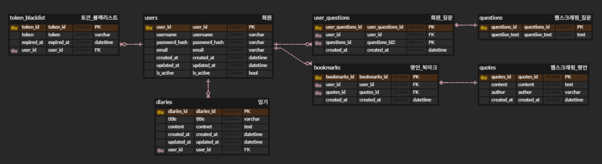

# project_OZdiary

Daily Diary System

🌙 Danbam
— 당신의 하루의 끝이 달콤하기를.

Danbam은 하루의 끝에서 스스로를 돌아보는 일기 + 명언 + 질문 기반 자기성찰 서비스입니다.

Danbam은 사용자가 하루에 하나의 질문을 받고,
그 질문을 바탕으로 일기를 작성하며 의미 있는 하루를 기록할 수 있도록 돕는 서비스입니다.

1. 하루 한 번 제공되는 자기성찰 질문

2. 자유롭게 작성하는 개인 일기

3. 랜덤 명언 제공 및 북마크 기능

4. JWT 기반 인증으로 안전한 사용자 관리

사용자가 받은 질문, 작성한 일기, 북마크한 명언을 명확하게 추적할 수 있도록 관계를 구성했습니다.

users : token_blacklist = 1 : N

- 한명의 회원이 만료된 여러 토큰을 가질 수 있습니다.

users : diaries = 1 : N

- 한명의 회원이 여러 일기를 작성할 수 있습니다.

users : user_questions  = 1 : N

- 한명의 회원이 여러 자기성찰 질문을 받을 수 있습니다.

users : bookmarks = 1 : N

- 한명의 회원이 여러 명언 북마크를 할 수 있습니다.

user_questions : questions = 1 : 1

- 하나의 자기성찰 질문은 오직 하나의 스크래핑 질문과 연결됩니다.

bookmarks : quotes = 1 : 1

- 하나의 북마크는 오직 하나의 스크래핑 명언과 연결됩니다.
